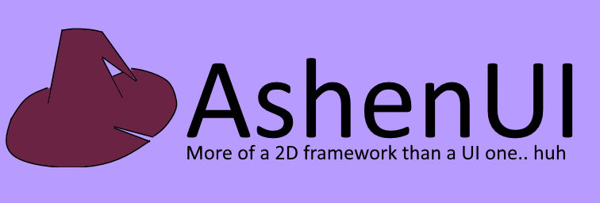

# An UI Framework designed to be lightweight.
This is the project that will power Irie Composer.
and possibly the main reason why that project is lightweight 
in the first place.

Its still under an extreme early phase of development; for that
reason there isn't any documentation in how to use it.

there's a sub project in this repo referring to AshenBitmap, 
a custom image format i created specifically for this library.